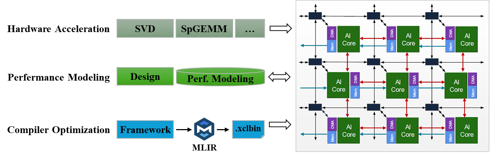
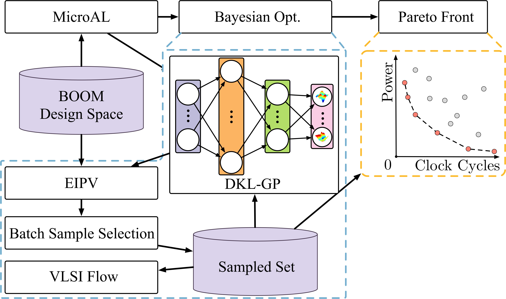
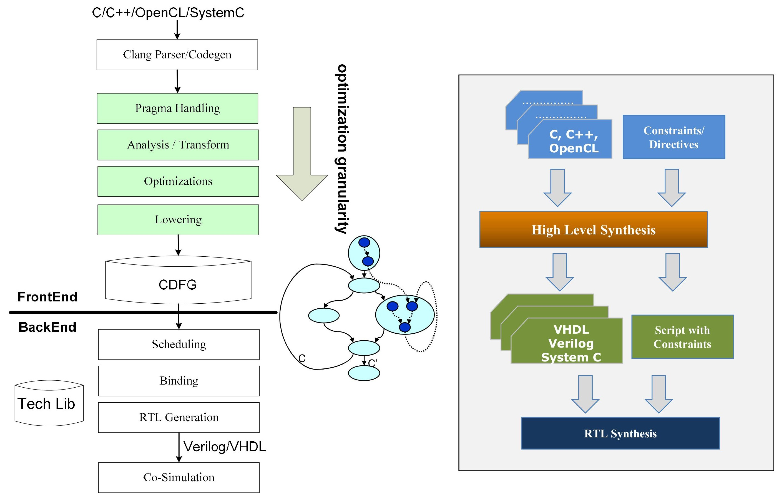
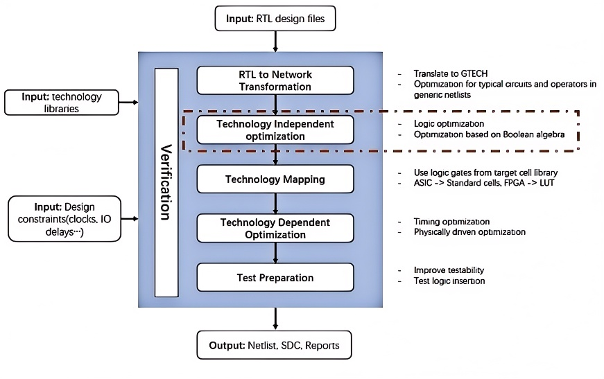
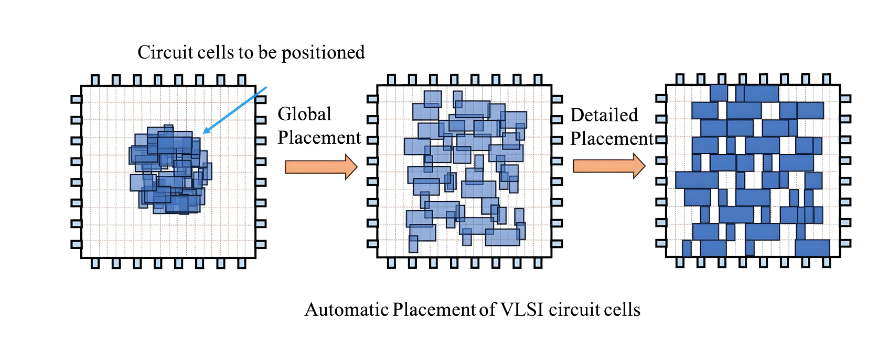
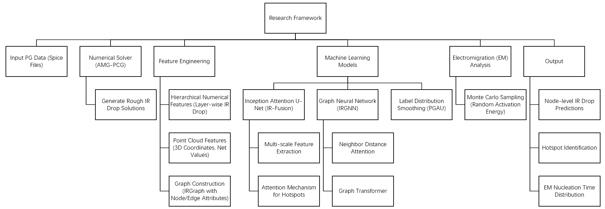
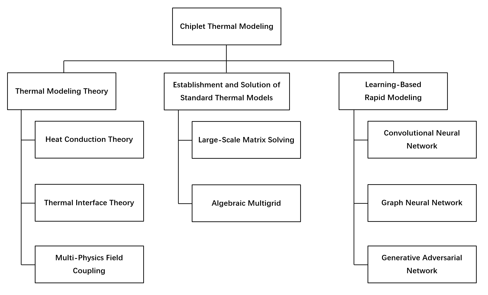

# 1.Heterogeneous Architecture Exploration, Accelerator and Compiler 
## AI Engine (AIE) for Versal Platform

The AI Engine (AIE) is an adaptive intelligence processing unit integrated on Xilinx (AMD)'s Versal heterogeneous computing platforms and RyzenAI devices. Our research focuses on hardware acceleration leveraging AIE for domain-specific applications, as well as performance modeling and compiler optimization for general-purpose workloads. Driven by AMD Vitis and open-source MLIR-based compiler toolchains, we are systematically investigating promising compiler optimization techniques tailored for AIE architectures. Our work aims to enhance programmability, efficiency, and performance scalability across diverse AIE/AIE-ML based applications and frameworks.

AI 引擎（AIE）是赛灵思（AMD）公司推出的自适应智能处理芯片，搭载于赛灵思（ AMD）公司的 Versal ACAP 异构计算平台和 RyzenAI 处理器产品。团队目前集中于针对 AIE 异构平台进行特定领域应用的硬件加速、性能建模以及编译器优化工作。在 AMD Vitis 统一软件平台和开源 MLIR 工具链的支持下，本团队未来将专注于探索 AIE 硬件架构下的编译器优化方法，提高 AIE/AIE-ML 平台中各种应用框架的可编程性、性能和能耗。

## Design Space Exploration (DSE) for CPU Architecture

We focus on the research and innovation of architecture-level Design Space Exploration (DSE) algorithms, aiming to provide automated and intelligent decision-making support for the architectural design of advanced chips, processors, and heterogeneous computing systems. By integrating architectural modeling, optimization algorithms, and artificial intelligence technologies, the innovative framework proposed by our team aims to break through the efficiency bottleneck of traditional design processes and assist architectural designer in quickly identifying the optimal architectural solutions with high performance, low power, and high reliability in the complex multi - dimensional design space.

Machine learning-assisted design space exploration is one of our main research directions, aiming to solve the multi-objective conflict trade-off problems in complex architecture design by integrating reinforcement learning, transfer learning, and Bayesian optimization techniques. Traditional design space exploration often falls into the 'curse of dimensionality' due to high objective dimensions and strong parameter coupling, leading to low search efficiency and reliance on human experience. Our tool dynamically builds a parameter-PPA proxy model, combined with adaptive sampling strategies, intelligently identifying nonlinear associations between key design variables and efficiently approaching the Pareto front using multi-objective optimization algorithms. Relevant achievements have been published in top conferences such as ICCAD and DAC, and have been applied to the RISC-V BOOM CPU processor. 

In the future, we will develop a cross-level collaborative design toolchain for the next generation of integrated circuit systems, accelerate the integration of machine learning algorithms and architecture design, and actively carry out cutting-edge research in agile architecture modeling, large language model assisted methods, and architecture-level expression of multi-die interconnection, further promoting the construction of an open-source ecosystem for tools and reducing the technical barriers for advanced architecture design.

我们专注于架构级设计空间探索（Design Space Exploration, DSE）算法的研发与创新，致力于为先进芯片、处理器及异构计算系统等领域的架构设计提供自动化、智能化的决策支持。通过融合体系结构建模、优化算法与人工智能技术，团队所提出创新框架旨在突破传统设计流程的效率瓶颈，帮助架构设计师在复杂的多维设计空间中快速定位高性能、低功耗、高可靠性的最优架构方案。

机器学习辅助设计空间探索是我们主要的研究方向之一，旨在通过融合强化学习、迁移学习与贝叶斯优化技术，破解复杂架构设计中多目标冲突的权衡难题。传统设计空间探索往往因目标维度高、参数耦合性强而陷入“维度灾难”，导致搜索效率低下且依赖人工经验。我们的工具通过动态构建参数-PPA的代理模型，结合自适应采样策略，智能识别关键设计变量之间的非线性关联，并利用多目标优化算法高效逼近Pareto前沿。相关成果在ICCAD，DAC等顶级会议发表，并应用于RISC-V BOOM CPU处理器。

未来，团队将面向新一代集成电路体系打造跨层级协同设计工具链，加速机器学习算法与架构设计领域的融合，同时积极开展敏捷架构建模、大语言模型辅助方法、多芯粒互联的架构级表达等前沿研究，进一步推动工具的开源生态建设，降低先进架构设计的技术门槛。

# 2.Synthesis for FPGA/ASIC
## High-level Synthesis (HLS)
High-Level Synthesis (HLS) is a transformative technology in Electronic Design Automation (EDA) that enables the automatic generation of hardware designs from high-level programming languages such as C, C++, or Python. The primary function of HLS tools is to bridge the gap between software and hardware development, allowing designers to focus on algorithmic optimization while the tool handles the complexities of hardware implementation. This significantly reduces development time and makes hardware design more accessible to software engineers.

As shown in the diagram, the HLS (High-Level Synthesis) process is typically divided into two parts: the front-end and the back-end. The front-end is responsible for parsing high-level language code into an intermediate representation (IR) and applying optimization techniques (such as loop unrolling, pipelining, and dataflow analysis) to generate an efficient hardware architecture. The back-end then translates the optimized IR into target hardware description languages (HDLs), performs resource allocation and scheduling, and generates the final RTL (Register Transfer Level) code. 

Our research team focuses on two critical aspects of HLS: Design Space Exploration (DSE) and Quality of Results (QoR) Estimation. In DSE, we develop methodologies to systematically explore and optimize the vast design space of HLS-generated hardware, balancing performance, area, and power consumption. For QoR estimation, we investigate predictive models and analytical techniques to accurately estimate hardware metrics (e.g., latency, resource utilization, and power) at early design stages, reducing the need for time-consuming synthesis and place-and-route iterations.

高层次综合（High-Level Synthesis, HLS）是电子设计自动化（EDA）前端的一项重要技术，它能够将 C、C++ 或 Python 等高级编程语言自动转换为硬件设计。HLS 工具的核心功能是弥合软件开发和硬件设计之间的鸿沟，使设计者能够专注于算法优化，而工具则负责处理硬件实现的复杂性。这极大地缩短了开发时间，并使硬件设计对软件工程师更加友好。

如图所示，HLS 流程通常分为前端和后端两部分：前端负责将高级语言代码解析为中间表示（IR），并应用优化技术（如循环展开、流水线和数据流分析）以生成高效的硬件架构；后端则将优化后的 IR 转换为目标硬件描述语言，并进行资源分配、调度和生成最终的 RTL 代码。

我们的研究团队专注于 HLS 的两个关键方向：设计空间探索（Design Space Exploration, DSE）和结果质量预估（Quality of Results, QoR Estimation）。在 DSE 方面，我们开发了系统化的方法来探索和优化 HLS 生成的硬件设计空间，平衡性能、面积和功耗等指标。在 QoR 预估方面，我们研究了预测模型和分析技术，以在设计早期阶段准确估计硬件指标（如延迟、资源利用率和功耗），从而减少耗时的综合和布局布线迭代。
## Logic Synthesis
Logic synthesis is the process of transforming high-level abstract specifications of circuit behavior (such as Register Transfer Level (RTL)) into a gate-level design implementation. Common examples include the synthesis of designs specified in hardware description languages (such as VHDL and Verilog). Logic synthesis enables designers to define desired functionality at a high level without focusing on the low-level gate implementation details. The process includes stages such as translation, optimization, and technology mapping to optimize the circuit's performance, power, and area (PPA). 

The optimization problems involved in logic synthesis are typically NP-hard, requiring the use of various heuristic methods to find suitable solutions.
With the success of Artificial Intelligence (AI) in fields such as physical design, computer vision (CV), and natural language processing (NLP), leveraging AI to drive logic synthesis to meet higher PPA and runtime requirements has become a challenging problem. Our team currently focuses on operator sequence optimization problems. Due to the exponential growth in the possible optimization algorithm sequences, exploring an effective design space is highly challenging. We use reinforcement learning to optimize the results of the synthesis process over time, continuously improving the AI model through feedback mechanisms. In the future, we will further explore how to apply AI methods to improve existing logic optimization operators, driving the intelligent development of logic synthesis.

逻辑综合是将高层次的电路行为的抽象规范（如寄存器传输级别(RTL)）转化为逻辑门级实现的过程，常见的例子包括从硬件描述语言（如VHDL、Verilog）到设计实现的转换。逻辑综合使设计人员能够在高层次上定义功能，而无需关注底层的门级实现细节。整个过程包括翻译、优化和工艺映射等阶段，优化电路的性能、功率和面积（PPA）。逻辑综合涉及的优化问题通常是NP-hard的，因此需要使用多种启发式方法来获得合适的解决方案。随着人工智能（AI）在物理设计、计算机视觉（CV）和自然语言处理（NLP）等领域的成功，如何利用AI推动逻辑综合，以满足更高的PPA和运行时间要求，成为一个有挑战性的问题。我们团队目前专注于算子序列优化问题，由于优化算法序列的可能性呈指数级增长，探索有效的设计空间具有较大挑战。我们采用强化学习来优化综合过程中的结果，并通过反馈机制不断改进AI模型。未来，我们将进一步探索如何运用AI方法来改进现有的逻辑优化算子，从而推动逻辑综合的智能化发展。

# 3.Physical Design
## Floorplan
## Placement
Placement is a critical but time-consuming step in the VLSI design flow. As it determines the locations of standard cells in the physical layout, its quality has significant impacts on the later stages in the flow such as routing and post-layout optimization. 

The goal of VLSI automatic placement is to determine the positions of all circuit cells within the chip layout, minimizing metrics such as total wirelength while satisfying design constraints like non-overlapping cells. Since placement is an NP-hard problem and cannot be solved directly, it is typically divided into three stages: global placement, legalization, and detailed placement.

In global placement, cell non-overlap is treated as a soft constraint, and the primary objective is to determine the approximate positions of circuit cells to minimize metrics such as total wirelength, allowing cell overlaps in the intermediate results. Legalization eliminates cell overlaps while preserving the global placement results as much as possible, aligning cell boundaries with rows vertically and grid edges horizontally. Detailed placement further fine-tunes the legalized results through local cell swaps and 
other adjustments to achieve better performance metrics. Since legalization and detailed placement depend on the solution from global placement, global placement is crucial and is the most critical and time consuming stage of the placement process.

布局是超⼤规模集成电路设计流程中⼀个关键但耗时的步骤。由于它决定了标准单元在物理布局中的位置，其质
量对流程的后期阶段（如布线和布局后优化）有重⼤影响。

VLSI⾃动布局的⽬标是在芯⽚版图内确定所有电路单元的位置，使得总线⻓等⼀些指标最⼩，同时满⾜⼀些设计
约束例如单元之间不重叠。由于布局是NP-hard问题，往往⽆法⼀步到位解决，因此常拆解为全局布局、合法化和
详细布局三个阶段求解。全局布局对单元不重叠视为软约束，根据总线⻓最⼩等⽬标确定电路单元的⼤致位置，
布局结果允许单元重叠。合法化在尽量保持全局布局的结果下消除单元重叠，并让单元上下边界对⻬⾏，左边界
对⻬⽹格边。详细布局进⼀步微调合法化的结果，例如局部交换单元位置，以寻求更好的指标结果。由于合法化
和详细布局依赖于全局布局的解，因此全局布局⾄关重要，也是布局中最为关键且耗时的⼀个环节。

### Current Research Directions:
- Chiplet/3D IC Heterogeneous Integration and Placement
- Timing-Driven Placement and Closed-Loop Optimization
- Variation-AwarePlacement for Carbon-Based Circuits

### 当前研究⽅向：
- 芯粒/三维集成电路异构集成与布局
- 时序驱动布局和闭环优化
- 碳基电路的变化感知布局

## EMIR
As integrated circuit (IC) designs scale to unprecedented complexity, power grid (PG) analysis for voltage drop (IR drop) and electromigration (EM) has become a critical challenge. Our team focuses on developing advanced machine learning (ML) and numerical methods to address inefficiencies in traditional analysis tools, enabling rapid and accurate evaluation of power integrity in large-scale ICs. We combine numerical solvers like AMG-PCG with ML models such as IR-Fusion and PGAU to balance accuracy and speed, leveraging hierarchical feature fusion, attention mechanisms, and graph-based modeling (e.g., IRGNN) for fine-grained IR drop predictions. For EM analysis, we propose a fast estimation method using Monte Carlo sampling of random activation energy to account for stochastic fabrication variations. Current work emphasizes enhancing model scalability for industrial PGs, exploring edge computing for real-time monitoring, and integrating physics-based models with deep learning. Future directions include hardware acceleration of hybrid solvers, self-supervised learning for unlabeled data, and advanced uncertainty quantification.

随着集成电路（IC）设计复杂度的急剧增加，电源网格（PG）的电压降（IR Drop）和电迁移（EM）分析成为关键挑战。我们团队致力于结合先进的机器学习（ML）与数值方法，解决传统分析工具的效率问题，实现大规模 IC 中电源完整性的快速精准评估。通过结合 AMG-PCG 数值求解器与 IR-Fusion、PGAU 等 ML 模型，利用层次化特征融合、注意力机制和图神经网络（如 IRGNN）实现细粒度 IR Drop 预测。针对电迁移分析，提出基于随机激活能蒙特卡洛采样的快速估计方法，应对制造工艺的随机性。当前研究聚焦于提升工业级电源网格模型的可扩展性、探索边缘计算实时监测技术，以及融合物理模型与深度学习的多尺度分析。未来方向包括混合求解器的硬件加速、无标签数据的自监督学习开发，以及电迁移与电压降预测的高级不确定性量化。

# 4.Chiplet Tools
## Simulation and Modeling

With the advent of the post-Moore era, advanced packaging technologies have gained increasing attention and even emerged as one of the most promising development directions in the integrated circuit industry. Chiplet technology decomposes traditional SoC architectures into multiple single-function or multi-functional chiplets that are interconnected through substrate-level integration within a single package to form complete complex functional chips. While driving chip systems toward higher performance, Chiplet technology also introduces exacerbated power consumption and thermal dissipation challenges. Currently, there is a notable deficiency in architectural-level power modeling and thermal simulation EDA tools specifically addressing these issues.

We focuses on backend EDA tool development optimized for Chiplet-packaged ICs, with particular emphasis on resolving thermal modeling challenges in multi-physics coupled simulations that arise from the heterogeneous and heterogenous integration characteristics of Chiplet packaging. Our team is currently dedicated to implementing faster and more accurate transient thermal simulations through deep learning algorithms, effectively compensating for the limitations of conventional thermal simulation methodologies that suffer from slow computation speeds and excessive computational resource requirements. Looking forward, we plan to account for the growing diversity of Chiplet packaging configurations and develop a cross-level modeling framework specifically tailored for Chiplet interconnect architectures. This advancement aims to expand the applicability range of existing models and propel the evolution of design tools for heterogeneous integration chips.

随着后摩尔时代的到来，先进封装技术愈发受到关注，甚至成为集成电路产业最有潜力的发展方向之一。其中，Chiplet技术将传统的系统级芯片划分为多个单功能或多功能组合的“芯粒”,在一个封装内通过基板互连成为一个完整的复杂功能芯片。Chiplet技术在推动着芯片系统向着更高性能发展的同时也带来了更严重的功耗和散热问题，而目前针对此问题的架构级功耗建模和热仿真EDA工具比较缺乏。

我们聚焦于更适合Chiplet封装芯片的EDA工具后端设计，针对Chiplet封装异质异构特性，重点突破多物理场耦合仿真中的热建模难题。当前，团队致力于利用深度学习算法实现更快、更精准的瞬态热仿真，以更好的效果弥补传统热仿真方针速度慢、算力要求高等缺陷。未来，我们将进一步考虑Chiplet封装形式多样性，致力于设计面向Chiplet互连架构的跨层级建模框架以扩宽模型适用范围，推动异质异构集成芯片设计工具发展。

## Physical Design