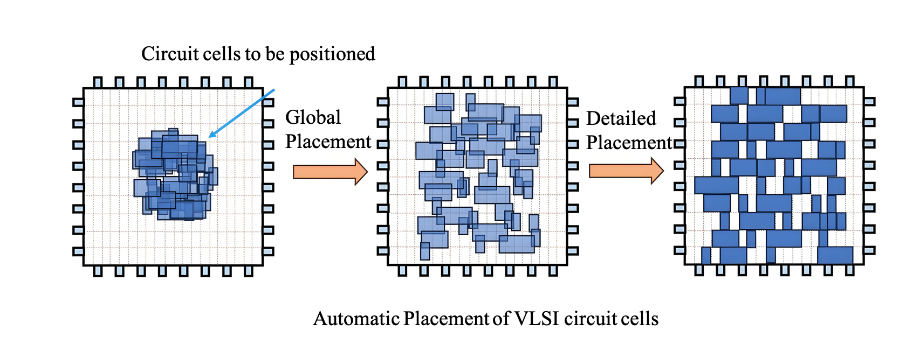

# Heterogeneous Architecture Exploration, Accelerator and Compiler 
## AI Engine (AIE) for Versal Platform

The AI Engine (AIE) is an adaptive intelligence processing unit integrated on Xilinx (AMD)'s Versal heterogeneous computing platforms and RyzenAI devices. Our research focuses on hardware acceleration leveraging AIE for domain-specific applications, as well as performance modeling and compiler optimization for general-purpose workloads. Driven by AMD Vitis and open-source MLIR-based compiler toolchains, we are systematically investigating promising compiler optimization techniques tailored for AIE architectures. Our work aims to enhance programmability, efficiency, and performance scalability across diverse AIE/AIE-ML based applications and frameworks.

  

## Design Space Exploration (DSE) for CPU Architecture

# Synthesis for FPGA/ASIC
## High-level Synthesis (HLS)

## Logic Synthesis
Logic synthesis is the process of transforming high-level abstract specifications of circuit behavior (such as Register Transfer Level (RTL)) into a gate-level design implementation. Common examples include the synthesis of designs specified in hardware description languages (such as VHDL and Verilog). Logic synthesis enables designers to define desired functionality at a high level without focusing on the low-level gate implementation details. The process includes stages such as translation, optimization, and technology mapping to optimize the circuit's performance, power, and area (PPA). 

The optimization problems involved in logic synthesis are typically NP-hard, requiring the use of various heuristic methods to find suitable solutions.
With the success of Artificial Intelligence (AI) in fields such as physical design, computer vision (CV), and natural language processing (NLP), leveraging AI to drive logic synthesis to meet higher PPA and runtime requirements has become a challenging problem. Our team currently focuses on operator sequence optimization problems. Due to the exponential growth in the possible optimization algorithm sequences, exploring an effective design space is highly challenging. We use reinforcement learning to optimize the results of the synthesis process over time, continuously improving the AI model through feedback mechanisms. In the future, we will further explore how to apply AI methods to improve existing logic optimization operators, driving the intelligent development of logic synthesis.

逻辑综合是将高层次的电路行为的抽象规范（如寄存器传输级别(RTL)）转化为逻辑门级实现的过程，常见的例子包括从硬件描述语言（如VHDL、Verilog）到设计实现的转换。逻辑综合使设计人员能够在高层次上定义功能，而无需关注底层的门级实现细节。整个过程包括翻译、优化和工艺映射等阶段，优化电路的性能、功率和面积（PPA）。逻辑综合涉及的优化问题通常是NP-hard的，因此需要使用多种启发式方法来获得合适的解决方案。随着人工智能（AI）在物理设计、计算机视觉（CV）和自然语言处理（NLP）等领域的成功，如何利用AI推动逻辑综合，以满足更高的PPA和运行时间要求，成为一个有挑战性的问题。我们团队目前专注于算子序列优化问题，由于优化算法序列的可能性呈指数级增长，探索有效的设计空间具有较大挑战。我们采用强化学习来优化综合过程中的结果，并通过反馈机制不断改进AI模型。未来，我们将进一步探索如何运用AI方法来改进现有的逻辑优化算子，从而推动逻辑综合的智能化发展。

# Physical Design
## Floorplan
## Placement
Placement is a critical but time-consuming step in the VLSI design flow. As it determines the locations of standard cells in the physical layout, its quality has significant impacts on the later stages in the flow such as routing and post-layout optimization. 

The goal of VLSI automatic placement is to determine the positions of all circuit cells within the chip layout, minimizing metrics such as total wirelength while satisfying design constraints like non-overlapping cells. Since placement is an NP-hard problem and cannot be solved directly, it is typically divided into three stages: global placement, legalization, and detailed placement.

In global placement, cell non-overlap is treated as a soft constraint, and the primary objective is to determine the approximate positions of circuit cells to minimize metrics such as total wirelength, allowing cell overlaps in the intermediate results. Legalization eliminates cell overlaps while preserving the global placement results as much as possible, aligning cell boundaries with rows vertically and grid edges horizontally. Detailed placement further fine-tunes the legalized results through local cell swaps and 
other adjustments to achieve better performance metrics. Since legalization and detailed placement depend on the solution from global placement, global placement is crucial and is the most critical and time consuming stage of the placement process.

布局是超⼤规模集成电路设计流程中⼀个关键但耗时的步骤。由于它决定了标准单元在物理布局中的位置，其质
量对流程的后期阶段（如布线和布局后优化）有重⼤影响。

VLSI⾃动布局的⽬标是在芯⽚版图内确定所有电路单元的位置，使得总线⻓等⼀些指标最⼩，同时满⾜⼀些设计
约束例如单元之间不重叠。由于布局是NP-hard问题，往往⽆法⼀步到位解决，因此常拆解为全局布局、合法化和
详细布局三个阶段求解。全局布局对单元不重叠视为软约束，根据总线⻓最⼩等⽬标确定电路单元的⼤致位置，
布局结果允许单元重叠。合法化在尽量保持全局布局的结果下消除单元重叠，并让单元上下边界对⻬⾏，左边界
对⻬⽹格边。详细布局进⼀步微调合法化的结果，例如局部交换单元位置，以寻求更好的指标结果。由于合法化
和详细布局依赖于全局布局的解，因此全局布局⾄关重要，也是布局中最为关键且耗时的⼀个环节。

### Current Research Directions:
- Chiplet/3D IC Heterogeneous Integration and Placement
- Timing-Driven Placement and Closed-Loop Optimization
- Variation-AwarePlacement for Carbon-Based Circuits

### 当前研究⽅向：
- 芯粒/三维集成电路异构集成与布局
- 时序驱动布局和闭环优化
- 碳基电路的变化感知布局

## EMIR

# Chiplet Tools
## Simulation and Modeling
## Physical Design