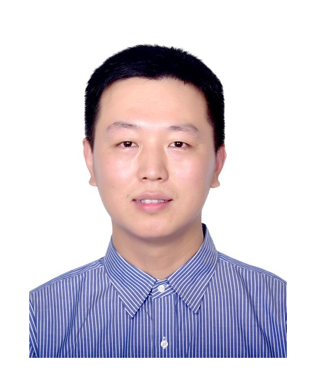

# Prof Kang Zhao (赵康)

## Short Bio

Kang Zhao joined the Department of Integrated Circuits, Beijing University of Posts and Telecommunications (BUPT) as a Professor in 2022. He has been deeply involved in the field of integrated circuit EDA for nearly 20 years, and has both college work experience and rich experience in high-end product design of international leading enterprises.

In 2009, he graduated from the EDA Lab of Tsinghua University, and then continued to work in Tsinghua for two years. He has presided over and participated in the NSFC, China Postdoctoral Science Foundation, and National Key R&D Program of China. He joined Intel Lab in 2011, and participated in Intel research projects such as Clanton processors, HW/SW co-verification, and intelligence robots. In 2016, he joined Xilinx (AMD) Inc, and led Xilinx High-level Synthesis (HLS) product team.

In 2022, he joined the Beijing University of Posts and Telecommunications, focusing on the EDA and FPGA domain, especially HLS and logic synthesis. He is leading the project of National Key R&D Program of China.

赵康，北京邮电大学集成电路学院教授，博士生导师，北京市高端领军人才研究员。深耕集成电路EDA领域(Synthesis)近20年，既有高校工作经历，又有丰富的国际领军企业高端产品设计经验。

2009年博士毕业于清华大学计算机系EDA实验室，之后留校工作两年，曾主持参与国家自然科学基金、国家博士后基金、十一五核高基重大专项。2011年加盟英特尔研究院，期间参与Intel Clanton处理器、软硬协同验证、人工智能机器人等项目。2016年加盟Xilinx(AMD)北京研发中心，领导Xilinx(AMD)的EDA高层次综合产品团队，对接全球FPGA领域最先进的HLS产品。

2022年加盟北京邮电大学集成电路学院，专注于集成电路学科的EDA方向，尤其侧重数字前端的高层次综合与逻辑综合。目前以项目负责人身份牵头十四五科技部重点研发项目1项，若干国家项目与企业合作项目。

## Research Interests
Electronic Design Automation; FPGA tools; Compiler optimization; Architecture.

EDA电子设计自动化；FPGA工具；编译优化；体系结构

## Projects
### Current Academic Projects
- National Key R&D Program of China (2022-2025). Project top leader. 主持科技部重点研发项目.

### Finished Academic Projects
- National Natural Science Foundation of China (2012-2014). Project leader. 主持国家自然科学基金项目.
- China Postdoctoral Science Foundation (2010-2011). Project leader. 主持博士后基金项目.
- 973 Key Project of Chinese National Programs for Fundamental Research and Development (2005-2011). 参与国家973项目.

### Finished Industry Projects
- Xilinx Vitis HLS Product Release (2018-2022). Xilinx Beijing RD Team Leader.主持Xilinx Vitis HLS产品项目.
- Intel Home Robot (2015-2016). 参与英特尔机器人项目.
- Intel Clanton Processor project (2011-2014). 参与英特尔处理器项目.

## Professional Services
- TPC Chair for FPT'2025 (FPGA international conference): [Link](https://fpt2025.shanghaitech.edu.cn/committee/)
- Editorial committee member for "Journal of Computer-Aided Design & Computer Graphics", 2023-now. (国内A类期刊《计算机辅助设计与图形学学报》)
- Publicity Chair for FPT'2022 (FPGA international conference).
- Program Commitee for FPT'2014 (FPGA international conference).
- Secretary and Web Chair for FPT'2010 (FPGA international conference).
- Secretary for CAD/Graphics'2010 (计算机辅助设计与图形学会议)
- Reviewer for top conferences in the areas of EDA and FPGA, including DAC, ICCAD, DATE, ICCD, FPGA, FCCM, FPL, etc.
