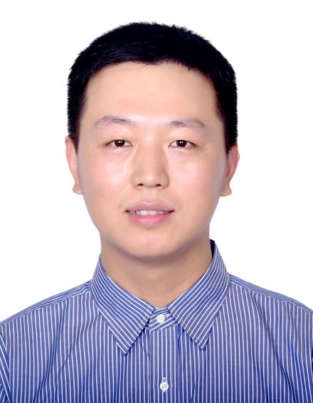

# Prof Kang Zhao

## Short Bio

Kang Zhao joined the Department of Integrated Circuits, Beijing University of Posts and Telecommunications (BUPT) as a Professor in 2022. He has been deeply involved in the field of integrated circuit EDA for nearly 20 years, and has both college work experience and rich experience in high-end product design of international leading enterprises.

In 2009, he graduated from the EDA Lab of Tsinghua University, and then continued to work in Tsinghua for two years. He has presided over and participated in the NSFC, China Postdoctoral Science Foundation, and National Key R&D Program of China. He joined Intel Lab in 2011, and participated in Intel research projects such as Clanton processors, HW/SW co-verification, and intelligence robots. In 2016, he joined Xilinx (AMD) Inc, and led Xilinx High-level Synthesis (HLS) product team.

In 2022, he joined the Beijing University of Posts and Telecommunications, focusing on the EDA and FPGA domain, especially HLS and logic synthesis. He is leading the project of National Key R&D Program of China.

赵康，北京邮电大学集成电路学院教授，博士生导师。深耕集成电路EDA领域(Synthesis)近20年，既有高校工作经历，又有丰富的国际领军企业高端产品设计经验。

2009年博士毕业于清华大学计算机系EDA实验室，之后留校工作两年，曾主持参与国家自然科学基金、国家博士后基金、十一五核高基重大专项。2011年加盟英特尔研究院，期间参与Intel Clanton处理器、软硬协同验证、人工智能机器人等项目。2016年加盟Xilinx(AMD)北京研发中心，领导Xilinx(AMD)的EDA高层次综合产品团队，对接全球FPGA领域最先进的HLS产品。

2022年加盟北京邮电大学集成电路学院，专注于集成电路学科的EDA方向，尤其侧重数字前端的高层次综合与逻辑综合。目前以项目负责人身份牵头十四五科技部重点研发项目1项，若干企业合作项目。

## Research Interests
Electronic Design Automation; FPGA tools; Compiler optimization; Architecture.

EDA电子设计自动化；FPGA工具；编译优化；体系结构

## Academic Projects (Current)
- National Key R&D Program of China (2022-2025). Project top leader. Chip and tool design for DPU.
- National scientific research projects (2022-2024). Project leader. HLS tool optimization.

- 科技部十四五重点研发计划 (2022-2025). 项目总体牵头负责人. DPU芯片设计与工具开发.
- 国家科研项目 (2022-2024). 项目负责人. 高层综合EDA工具.

## Finished Projects
- National Natural Science Foundation of China (2012-2014). Project leader. ISE synthesis and verification for ASIP.
- China Postdoctoral Science Foundation (2010-2011). Project leader. Instruction custom algorithm and platform.
- 973 Key Project of Chinese National Programs for Fundamental Research and Development (2005-2011). Participate. Design and Verification for High-Performance Core.

- 国家自然科学基金 (2012-2014). 项目负责人. 专用指令集处理器指令定制与验证.
- 国家博士后基金 (2010-2011). 项目负责人. 专用指令自动定制算法与平台.
- 973国家重点基础研发(2005-2011). 参与. 高性能的处理芯片设计、验证与测试.
